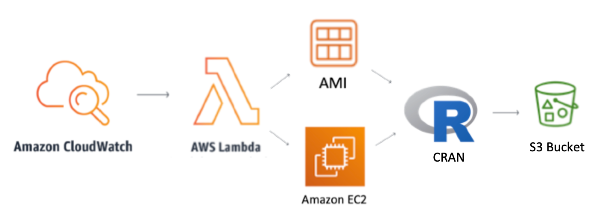

---
output: github_document
---
  
```{r setup, include=FALSE}
knitr::opts_chunk$set(echo = TRUE)
```

# collidr <a href='https://github.com/stevecondylios/collidr'></a>

[](https://cran.r-project.org/package=collidr)

`collidr` checks for namespace collisions against half a million packages and functions on CRAN. 

### Usage

See if a function/package called "group_by", like so

```R
# install.packages("collidr")
library(collidr)

CRAN_collisions("group_by", CRANdf = getCRAN())
```

* substitute "group_by" for any function name you wish to check


### Advantages

Distinctly named functions

* reduce code ambiguity, and,
* reduce unintentional function calls
    * e.g. you may coded `select()` meaning `dplyr::select()`, 
    but instead invoked `MASS::select()` due to `MASS` being loaded after `dplyr`


### Caveats

`collidr::CRANdf` is the data.frame used to store the names of packages and functions found on CRAN.
You can see when it was last updated with `attributes(collidr::CRANdf)$last_updated`. Retrieve a more up
to date version with `getCRAN()`.

Due to how this data.frame is obtained, the results are not perfect. The absense of a function name
from the data.frame does not guarantee that the function is not on CRAN, and, conversely, a function
name found in the data.frame doesn't guarantee that it is a function in a package on CRAN.

These imperfections are due to imperfections in the regular expressions required to parse the ~16,000 
libraries found on CRAN.

### How collidr Works

`collidr` runs on Amazon Web Services (AWS) infrastructure and visits CRAN every 3 hours, parses 
package information, and stores and updated data.frame in S3. The data.frame is accessible for 
[download](https://collidr-api.s3-ap-southeast-2.amazonaws.com/pfd.RDS), or via `getCRAN()`

{:height="700" width="400"}


## Issues and Feature Requests

When reporting an issue, please include:

* Example code that reproduces the **observed** behavior.
* An explanation of what the **expected** behavior is.


For feature requests, raise an issue with the following:

* The desired functionality
* Example inputs and desired output


## Pull Requests

Pull requests are welcomed. 

Any new functions should follow the conventions established by the the package's existing functions. Please ensure

* Functions are sensibly named
* The __intent__ of the contribution is clear
* At least one example is provided in the documentation

